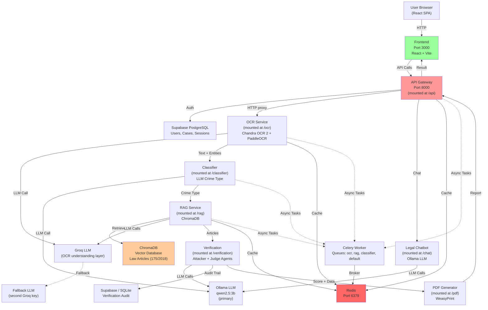

# AI Cybercrime Evidence Builder — System Architecture

---

## Table of Contents

1. [Executive Summary](#1-executive-summary)
2. [Repository Structure](#2-repository-structure)
3. [High-Level Architecture](#3-high-level-architecture)
4. [Frontend Architecture](#4-frontend-architecture)
5. [Backend Architecture](#5-backend-architecture)
6. [OCR Pipeline](#6-ocr-pipeline)
7. [Classification Pipeline](#7-classification-pipeline)
8. [RAG Pipeline](#8-rag-pipeline)
9. [Verification Pipeline](#9-verification-pipeline)
10. [PDF Generation](#10-pdf-generation)
11. [Legal Chatbot](#11-legal-chatbot)
12. [Authentication & Authorization](#12-authentication--authorization)
13. [Database Architecture](#13-database-architecture)
14. [Deployment Architecture](#14-deployment-architecture)
15. [Environment Variables](#15-environment-variables)

---

## 1. Executive Summary

### 1.1 Project Purpose

**AI Cybercrime Evidence Builder (ACEB)** is an intelligent legal-tech system that helps victims of online crimes in Egypt automatically structure, analyze, and prepare legally-grounded complaint reports. The system transforms raw digital evidence (screenshots, PDFs, chat logs) into structured, law-backed complaint documents ready for submission to Egyptian law enforcement.

### 1.2 Technical Summary

```
┌─────────────────────────────────────────────────────────────┐
│                  ACEB Technical Stack                        │
├─────────────────────────────────────────────────────────────┤
│ Frontend:      React 18 + Vite + Tailwind CSS               │
│ Backend:       FastAPI (Python 3.11) — Monolithic            │
│ Database:      Supabase PostgreSQL                           │
│ Vector Store:  ChromaDB                                      │
│ LLM:           Ollama (primary) + Groq (cloud fallback)      │
│ OCR:           Chandra OCR 2 (primary) + PaddleOCR (fallback)│
│ Cache:         Redis                                         │
│ Async Tasks:   Celery + Redis                                │
│ Container:     Docker + Docker Compose                       │
│ Deployment:    Vercel (frontend) + Railway (backend)         │
└─────────────────────────────────────────────────────────────┘
```

---

## 2. Repository Structure

```
ai-CyberCrime/
├── README.md
├── SETUP.md
├── SYSTEM_ARCHITECTURE.md          # This file
├── API_DOCUMENTATION.md
├── DATABASE_SCHEMA.md
├── docker-compose.yml              # Container orchestration
├── .env.example                    # Environment variable template
│
├── backend/
│   ├── Dockerfile                  # Single backend container
│   ├── main.py                     # Monolithic FastAPI entry point
│   ├── requirements.txt            # All Python dependencies
│   │
│   ├── services/
│   │   ├── __init__.py
│   │   ├── api/                    # API Gateway (mounted at /api)
│   │   │   ├── main.py             # Routes: auth, analyze, cases, chat, admin
│   │   │   ├── auth.py             # JWT + bcrypt
│   │   │   ├── database.py         # Supabase operations
│   │   │   ├── models.py           # Pydantic schemas
│   │   │   ├── pipeline.py         # 6-stage orchestration
│   │   │   ├── resilience.py       # Retry logic
│   │   │   ├── security.py         # Input validation, rate limiting
│   │   │   ├── tasks.py            # Celery task definitions
│   │   │   └── db/migrations/
│   │   │       └── schema.sql
│   │   │
│   │   ├── auth/                   # Auth utilities (shared)
│   │   │   ├── auth.py             # JWT, bcrypt, pydantic models
│   │   │   └── middleware.py       # FastAPI dependencies
│   │   │
│   │   ├── ocr/                    # OCR Service (mounted at /ocr)
│   │   │   ├── main.py             # Endpoints: extract, batch, async jobs
│   │   │   ├── ocr_engine.py       # Chandra OCR 2 → PaddleOCR → Groq
│   │   │   ├── preprocessing.py    # Image enhancement
│   │   │   ├── arabic_utils.py     # Arabic normalization
│   │   │   ├── entities.py         # Entity extraction
│   │   │   ├── models.py           # Pydantic schemas
│   │   │   └── tasks.py            # Celery async OCR tasks
│   │   │
│   │   ├── classifier/             # Classifier (mounted at /classifier)
│   │   │   ├── main.py             # POST /classify
│   │   │   ├── prompts.py          # LLM classification prompt
│   │   │   ├── crime_definitions.py # Crime type definitions
│   │   │   ├── article_mapping.py   # Crime→Article mapping
│   │   │   ├── validators.py        # Evidence validators
│   │   │   ├── arabic_utils.py      # Arabic text handling
│   │   │   ├── models.py            # Output schema
│   │   │   ├── metrics_runtime.py   # Latency tracking
│   │   │   ├── metrics.py           # Prometheus metrics
│   │   │   └── tasks.py             # Celery classifier tasks
│   │   │
│   │   ├── rag/                    # RAG Service (mounted at /rag)
│   │   │   ├── main.py             # Endpoints: retrieve, index, stats
│   │   │   ├── config.py           # Configuration (ChromaDB, embedding)
│   │   │   ├── retriever.py        # Hybrid retrieval (BM25 + vector)
│   │   │   ├── reranker.py         # Cross-encoder reranking
│   │   │   ├── citations.py        # Citation validation
│   │   │   ├── chunker.py          # Document chunking
│   │   │   ├── query_transform.py  # HyDE, RAG-Fusion
│   │   │   ├── cache.py            # Semantic caching
│   │   │   ├── observability.py    # Metrics & logging
│   │   │   ├── ingestion.py        # Document ingestion
│   │   │   ├── build_knowledge_base.py
│   │   │   ├── parse_law.py
│   │   │   ├── tasks.py            # Celery RAG tasks
│   │   │   └── data/law_db/        # ChromaDB vector index
│   │   │
│   │   ├── verification/           # Verification (mounted at /verification)
│   │   │   ├── main.py             # POST /verify, GET /cases
│   │   │   ├── agents.py           # Attacker + Judge agents
│   │   │   ├── graph.py            # LangGraph orchestration
│   │   │   ├── strategies.py       # Crime-specific strategies
│   │   │   ├── timeline.py         # Timeline building
│   │   │   ├── database.py         # Local SQLite audit store
│   │   │   ├── supabase_store.py   # Supabase audit store
│   │   │   ├── scoring.py          # Evidence scoring
│   │   │   └── models.py           # Output schemas
│   │   │
│   │   ├── pdf/                    # PDF Generator (mounted at /pdf)
│   │   │   ├── main.py             # POST /generate, /generate-download
│   │   │   ├── generate.py         # WeasyPrint + Jinja2 generation
│   │   │   ├── templates/          # HTML templates (AR/EN)
│   │   │   └── fonts/              # Amiri, Cairo Arabic fonts
│   │   │
│   │   ├── chat/                   # Legal Chatbot (mounted at /chat)
│   │   │   ├── main.py             # POST /chat, /chat/reset, /chat/history
│   │   │   ├── prompts.py          # System prompt builder
│   │   │   └── prompts/            # Prompt templates
│   │   │
│   │   └── common/                 # Shared modules
│   │       ├── llm_client.py       # Groq LLM client with fallback
│   │       ├── celery_app.py       # Shared Celery app
│   │       ├── cache.py            # Redis cache client
│   │       └── logging.py          # Structured logging
│   │
│   └── requirements.txt
│
├── frontend/
│   ├── package.json
│   ├── vite.config.js
│   ├── tailwind.config.js
│   ├── index.html
│   ├── Dockerfile
│   └── src/
│       ├── App.jsx
│       ├── main.jsx
│       ├── index.css
│       ├── api/
│       │   ├── client.js           # Axios client with auth interceptor
│       │   ├── endpoints.js        # All API endpoint functions
│       │   ├── auth.js             # Auth API functions
│       │   ├── admin.js            # Admin API functions
│       │   └── hooks.js            # Custom hooks
│       ├── components/
│       │   ├── FileUpload.jsx
│       │   ├── EvidenceTimeline.jsx
│       │   ├── LegalReport.jsx
│       │   ├── VerificationButton.jsx
│       │   ├── layout/
│       │   │   ├── Header.jsx
│       │   │   ├── Sidebar.jsx
│       │   │   └── MainLayout.jsx
│       │   ├── ui/                 # Reusable UI components
│       │   └── verification/       # Verification components
│       ├── context/
│       │   ├── AuthContext.jsx     # Auth state management
│       │   ├── CaseContext.jsx     # Case state management
│       │   └── ThemeContext.jsx    # Theme + language
│       ├── hooks/
│       │   ├── useHealth.js
│       │   └── useSupabase.js
│       ├── lib/
│       │   ├── supabase.js
│       │   └── index.js
│       ├── pages/
│       │   ├── LandingPage.jsx
│       │   ├── LoginPage.jsx
│       │   ├── SignupPage.jsx
│       │   ├── DashboardPage.jsx
│       │   ├── CaseAnalysisPage.jsx
│       │   ├── ChatbotPage.jsx
│       │   ├── CaseHistoryPage.jsx
│       │   ├── SettingsPage.jsx
│       │   ├── VerificationsPage.jsx
│       │   ├── AdminPage.jsx
│       │   └── index.js
│       └── utils/
│           ├── constants.js
│           ├── formatters.js
│           ├── validators.js
│           ├── security.js
│           └── translations.js
│
├── data/
│   ├── law/
│   │   └── articles.json           # Egyptian law articles
│   └── test_cases/                  # Test case fixtures
│
├── scripts/
│   ├── start-dev.sh
│   ├── index_law.py
│   ├── parse_laws.py
│   ├── supabase_schema.sql         # Database DDL
│   ├── test-end-to-end.py
│   ├── validate_citations.py
│   └── validate_schema.py
│
└── tests/
    ├── test_classifier.py
    ├── test_ocr.py
    ├── test_rag.py
    ├── test_verification.py
    ├── test_pdf.py
    ├── test_llm_client.py
    ├── test_pipeline_e2e.py
    └── test_verification1.py
```

---

## 3. High-Level Architecture

### 3.1 Monolithic Design

The backend is a **single FastAPI monolith** (not microservices). All service modules are mounted as sub-applications in-process:

```
backend/main.py (uvicorn, port 8000)
│
├── /api         → services/api/main.py       (API Gateway — auth, cases, chat, admin)
├── /chat        → services/chat/main.py      (Legal Chatbot)
├── /classifier  → services/classifier/main.py(Crime Classification)
├── /ocr         → services/ocr/main.py       (OCR & Entity Extraction)
├── /rag         → services/rag/main.py       (Legal Article Retrieval)
├── /verification→ services/verification/main.py (Multi-Agent Verification)
├── /pdf         → services/pdf/main.py       (PDF Report Generation)
│
├── /health      → Main app health check
└── /api/health  → Gateway health check
```

The API Gateway (`/api`) is the primary entry point for the frontend. It enforces authentication, proxies to mounted sub-apps via HTTP (self-calls), and persists all state to Supabase. Sub-app mounts bypass the auth layer and are used internally.

### 3.2 System Diagram



### 3.3 Service Communication

All sub-services are **mounted in-process** within the same Python process. The API Gateway communicates with them by making HTTP requests to the same host (`http://backend:8000/{mount}`). Docker Compose sets `MONOLITH_BASE_URL=http://backend:8000` to enable this.

| Service       | Mount Point | Internal Port | Type          | Dependencies          |
|---------------|-------------|---------------|---------------|-----------------------|
| API Gateway   | `/api`      | 8000          | FastAPI       | Supabase, Redis       |
| OCR           | `/ocr`      | 8000          | FastAPI       | Redis (cache)         |
| Classifier    | `/classifier`| 8000          | FastAPI       | Groq API, Ollama      |
| RAG           | `/rag`      | 8000          | FastAPI       | ChromaDB, Redis       |
| Verification  | `/verification`| 8000        | FastAPI       | Groq API, Supabase    |
| PDF Generator | `/pdf`      | 8000          | FastAPI       | WeasyPrint            |
| Chatbot       | `/chat`     | 8000          | FastAPI       | Ollama, Groq API      |

### 3.4 Infrastructure Services

| Service       | Port  | Purpose                       |
|---------------|-------|-------------------------------|
| Redis         | 6379  | Cache (DB 0), Celery broker (DB 1), Celery backend (DB 2) |
| Ollama        | 11434 | Local LLM (qwen2.5:3b)       |

### 3.5 Celery Task Queues

| Queue       | Task                              | Concurrency |
|-------------|-----------------------------------|-------------|
| `ocr`       | OCR image processing              | 2           |
| `rag`       | Document ingestion                | 2           |
| `classifier`| Classification                    | 2           |
| `default`   | General pipeline tasks            | 2           |

### 3.6 Data Flow Through Pipeline

```
User Uploads Evidence Files
        ↓
   ┌────────────────────────────────────┐
   │ POST /api/analyze                   │
   │ - Validate files (max 5 × 10MB)    │
   │ - Generate case_id (CASE_XXXXXXXX)  │
   │ - Create case in Supabase           │
   │ - Return case_id immediately        │
   │ - Background: run_pipeline()        │
   └────────────────────────────────────┘
        ↓
   ┌────────────────────────────────────┐
   │ Stage 1: OCR + Entity Extraction    │
   │ - Chandra OCR 2 (primary)           │
   │ - PaddleOCR (fallback on low conf)  │
   │ - Groq understanding layer          │
   │ - Arabic text normalization         │
   │ - Entity extraction (phones, etc)   │
   │ - Redis caching                     │
   │ - Index user docs into RAG          │
   │ - Return: evidence_blocks[]         │
   └────────────────────────────────────┘
        ↓
   ┌────────────────────────────────────┐
   │ Stage 2: Crime Classification       │
   │ - Normalize Arabic text             │
   │ - LLM prompt with crime definitions │
   │ - Groq API (llama-3.3-70b)          │
   │ - Parse JSON response               │
   │ - Validate crime_type               │
   │ - Map to suggested articles         │
   │ - Return: ClassificationOutput      │
   └────────────────────────────────────┘
        ↓
   ┌────────────────────────────────────┐
   │ Stage 3: RAG Legal Retrieval        │
   │ - Query: crime_type + text          │
   │ - Query transformation (auto)       │
   │ - Semantic cache check (Redis)      │
   │ - Hybrid retrieval (BM25 + vector)  │
   │ - Cross-encoder reranking           │
   │ - Citation validation               │
   │ - Return: top_k law articles        │
   └────────────────────────────────────┘
        ↓
   ┌────────────────────────────────────┐
   │ Stage 4: Multi-Agent Verification   │
   │ - Attacker agent: find weaknesses   │
   │ - Judge agent: validate against law │
   │ - Multi-round (max 3)               │
   │ - Evidence scoring (0–100)          │
   │ - Grade: STRONG / MEDIUM / WEAK     │
   │ - Return: verification result       │
   └────────────────────────────────────┘
        ↓
   ┌────────────────────────────────────┐
   │ Stage 5: Results Aggregation        │
   │ - Combine all stage outputs         │
   │ - Track partial completions         │
   │ - Store in Supabase                 │
   │ - Return: full JSON result          │
   └────────────────────────────────────┘
        ↓
   User can download PDF via GET /api/pdf/{case_id}
   Or generate separately via POST /pdf/generate
```

---

## 4. Frontend Architecture

### 4.1 Technology Stack

**Framework:** React 18.3.1
**Bundler:** Vite 5.1.6
**Styling:** Tailwind CSS 3.4.1
**Routing:** React Router v6
**State Management:** React Context API
**HTTP Client:** Axios 1.6.7 (with JWT auto-refresh interceptor)
**Auth:** JWT tokens stored in localStorage

### 4.2 API Client Layer

The frontend always targets the API Gateway at `{VITE_API_URL}/api`. All requests go through the gateway which is the only layer that enforces auth and persists to database.

**Client Configuration:** `frontend/src/api/client.js`
- `baseURL`: `VITE_API_URL + /api`
- Auto-injects `Authorization: Bearer {token}`
- Auto-injects `X-Session-ID` and `X-Tenant-ID` headers
- Auto-refreshes tokens on 401
- Rate limit (429) and file size (413) handling

### 4.3 Component Hierarchy

```
App.jsx
├── BrowserRouter
│   └── AuthProvider
│       └── CaseProvider
│           └── ThemeProvider
│               └── MainLayout
│                   ├── Header (Navigation)
│                   ├── Sidebar (Menu)
│                   └── <Route Children>
│                       ├── LandingPage (/)
│                       ├── LoginPage (/login)
│                       ├── SignupPage (/signup)
│                       ├── ProtectedRoute
│                       │   ├── DashboardPage (/dashboard)
│                       │   ├── CaseAnalysisPage (/analyze)
│                       │   ├── ChatbotPage (/chatbot)
│                       │   ├── CaseHistoryPage (/history)
│                       │   ├── SettingsPage (/settings)
│                       │   ├── VerificationsPage (/verifications)
│                       │   └── AdminPage (/admin)
│                       └── Navigate (catch-all)
```

### 4.4 Routing

| Route            | Component           | Auth Required | Purpose               |
|------------------|---------------------|---------------|-----------------------|
| `/`              | LandingPage         | No            | Marketing page        |
| `/login`         | LoginPage           | No            | User login            |
| `/signup`        | SignupPage          | No            | User registration     |
| `/dashboard`     | DashboardPage       | Yes           | Case overview         |
| `/analyze`       | CaseAnalysisPage    | Yes           | Upload & analyze      |
| `/chatbot`       | ChatbotPage         | Yes           | Legal chat assistant  |
| `/history`       | CaseHistoryPage     | Yes           | Past cases            |
| `/settings`      | SettingsPage        | Yes           | User preferences      |
| `/verifications` | VerificationsPage   | Yes           | Verification audit    |
| `/admin`         | AdminPage           | Yes (admin)   | Admin dashboard       |

---

## 5. Backend Architecture

### 5.1 API Gateway (`/api`)

**Source:** `backend/services/api/main.py`
**Mount:** `app.mount("/api", api_app)`

**Responsibilities:**
- Route incoming requests to appropriate sub-services via HTTP self-calls
- Manage user authentication & JWT tokens
- Orchestrate the 5-stage pipeline (OCR → Classify → RAG → Verify → Aggregate)
- Store cases & chat history in Supabase
- Stream live progress via Server-Side Events (SSE)
- Rate limiting via `slowapi`
- CORS handling
- Security headers (X-Frame-Options, CSP, etc.)
- Input sanitization and validation
- Audit logging

**Pipeline Execution:**
- `POST /api/analyze` → async background pipeline
- `POST /api/analyze/json` → synchronous pipeline (returns full JSON)
- Progress tracked in-memory `case_progress_store` dict
- SSE streaming at `GET /api/cases/{case_id}/events`

### 5.2 OCR Service (`/ocr`)

**Source:** `backend/services/ocr/main.py`
**Engine:** Chandra OCR 2 (primary) → PaddleOCR (fallback) → Groq AI (understanding layer)

**Pipeline:**
```
Input File (PNG/JPEG/WebP/TIFF/PDF/TXT)
    ↓
Validate: magic bytes, size, MIME type
    ↓
(If TXT) → bypass OCR, decode UTF-8
(If Image/PDF)
    ├─ Preprocess: grayscale → contrast → normalize size
    ├─ Chandra OCR 2 (primary, threshold ≥ 0.85)
    │   └─ Confidence below threshold → PaddleOCR fallback
    ├─ Extract text blocks with confidence scores
    └─ Groq AI understanding layer (entity enhancement)
    ↓
Arabic Normalization:
    ├─ Remove diacritics (tashkeel)
    ├─ Unify Alef variants (أ إ آ → ا)
    └─ Fix Ta marbuta (ة → ه)
    ↓
Entity Extraction:
    ├─ Phone numbers    → Regex patterns
    ├─ Financial amounts → Numbers + currency keywords
    ├─ Dates            → Arabic/English patterns
    ├─ Emails           → Email regex
    ├─ URLs             → URL regex
    └─ IBANs            → Egyptian IBAN patterns
    ↓
Threat Indicator Analysis:
    ├─ Keyword matching (threat, blackmail, scam patterns)
    └─ Threat score (0–1)
    ↓
Output: OCRResponse with evidence_blocks, entities, confidence
```

### 5.3 Classifier Service (`/classifier`)

**Source:** `backend/services/classifier/main.py`

**Crime Types:**
| Type          | Arabic     | Description                               |
|---------------|------------|-------------------------------------------|
| `blackmail`   | ابتزاز     | Threatening to publish unless payment made |
| `scam`        | احتيال     | Fraudulent financial scheme                |
| `threat`      | تهديد      | Direct threats of harm                     |
| `defamation`  | تشهير      | False statements damaging reputation       |
| `privacy`     | انتهاك خصوصية | Privacy violation                       |
| `identity_theft` | سرقة هوية | Identity theft                          |

**LLM Flow:**
1. Normalize Arabic text
2. Send to Groq API with classification prompt + crime definitions
3. Parse JSON response
4. Validate crime_type
5. Map to suggested Egyptian law articles
6. Record latency metric
7. Return `ClassificationOutput`

### 5.4 RAG Service (`/rag`)

**Source:** `backend/services/rag/main.py`

**Retrieval Pipeline:**
```
User Query + Crime Type
    ↓
1. Query Transformation (if transform_strategy != "none")
   ├─ HyDE: Generate hypothetical document
   ├─ RAG-Fusion: Generate multiple related queries
   └─ Combine queries
    ↓
2. Semantic Cache Lookup (Redis)
   ├─ Hit (similarity > 0.92)? → Return cached results
   └─ Miss? → Continue
    ↓
3. Hybrid Retrieval (ChromaDB)
   ├─ Vector Search (embedding: all-MiniLM-L6-v2)
   │   └─ Get top_k×2 results
   └─ BM25 Search (lexical)
       └─ Get top_k×2 results
    ↓
4. Score Combination
   final_score = (BM25_weight × bm25_score) + (vector_weight × vector_score)
   BM25_weight: 0.3 | Vector_weight: 0.7
    ↓
5. Deduplication by article_number
    ↓
6. Cross-Encoder Reranking
   ├─ Model: cross-encoder/ms-marco-MiniLM-L-6-v2
   └─ Keep top_k (default 5)
    ↓
7. Citation Validation
   ├─ Verify each article exists in ChromaDB
   └─ Match crime_type
    ↓
8. Cache Result in Redis (TTL: 3600s)
    ↓
Output: Retrieved articles with scores
```

**Key Configuration:**
| Setting                | Default | Description                  |
|------------------------|---------|------------------------------|
| chunk_size             | 512     | Tokens per chunk             |
| chunk_overlap          | 200     | Overlap between chunks       |
| top_k                  | 5       | Articles to return           |
| bm25_weight            | 0.3     | Keyword search weight        |
| vector_weight          | 0.7     | Semantic search weight       |
| reranker_enabled       | true    | Cross-encoder reranking      |
| semantic_cache_enabled | true    | Redis semantic cache         |
| multi_tenant_enabled   | true    | Per-user RAG namespaces      |
| hyde_enabled           | true    | Hypothetical document        |
| rag_fusion_enabled     | true    | Multi-query fusion           |

### 5.5 Verification Service (`/verification`)

**Source:** `backend/services/verification/main.py`

**Multi-Agent Verification (LangGraph):**

```
Evidence + Classification + Articles
    ↓
ROUND 1:
├─ ATTACKER AGENT (skeptical prosecutor)
│  ├─ Crime-specific strategy from strategies.py
│  ├─ Structured challenges from rules
│  ├─ LLM-generated additional challenges
│  └─ Output: challenge text
│
├─ JUDGE AGENT (fair judge)
│  ├─ Build timeline from evidence entities
│  ├─ Evaluate claim against challenge + law articles
│  ├─ LLM evaluation
│  └─ Output: { status, claims_to_drop, articles_cited, confidence }
│
ROUND 2 (if NEEDS_REVISION):
├─ Attacker generates new challenges on revised claims
├─ Judge re-evaluates
└─ Max 3 rounds
    ↓
Final Status:
├─ APPROVED          → Claims supported by evidence + law
├─ NEEDS_REVISION    → Drop unsupported claims
└─ NEEDS_USER_REVIEW → Major gaps remain
```

**Audit Store:** Uses Supabase when env vars configured, falls back to local SQLite.

**Evidence Scoring:**
- **Score 0–100** based on: evidence strength, legal accuracy, claim support
- **Grade:** STRONG (≥70) | MEDIUM (40–69) | WEAK (<40)

### 5.6 PDF Generator (`/pdf`)

**Source:** `backend/services/pdf/main.py`

**Technology:** WeasyPrint + Jinja2 HTML templates

**PDF Structure:**
```
┌─────────────────────────────────┐
│ complaint_ar.html / en.html     │
├─────────────────────────────────┤
│ 1. Header (RTL for Arabic)      │
│ 2. Complainant Info             │
│ 3. Crime Summary                │
│ 4. Evidence Timeline            │
│ 5. Legal Basis (Law 175/2018)   │
│ 6. Evidence Strength Score      │
│ 7. Verification Audit           │
│ 8. Appendices (entities, etc.)  │
│ 9. Signature Section            │
└─────────────────────────────────┘
```

**Fonts:** Amiri (Arabic serif), Cairo (Arabic sans-serif)

### 5.7 Legal Chatbot (`/chat`)

**Source:** `backend/services/chat/main.py`

**LLM Chain:** Ollama (qwen2.5:3b) → Groq (fallback) → Rule-based (final fallback)

**Features:**
- Case-aware system prompt injection (crime type, articles, evidence score)
- Arabic and English support
- Only cites retrieved articles (no hallucination)
- Conversation history context (last 20 turns)
- PDF generation trigger from chat
- Multiple LLM providers with cascading fallback

---

## 6. Authentication & Authorization

### 6.1 JWT Token Flow

```
1. POST /api/auth/register
   ├─ Validate password strength (8+ chars, upper, lower, digit, special)
   ├─ Hash password with bcrypt (12 rounds)
   ├─ Create user in Supabase users table
   ├─ Issue access_token (30 min) + refresh_token (7 days)
   └─ Return tokens + user profile

2. POST /api/auth/login
   ├─ Look up user by email
   ├─ Verify password hash with bcrypt
   ├─ Update last_login_at
   ├─ Issue new tokens
   └─ Return tokens + user profile

3. Token Refresh (POST /api/auth/refresh)
   ├─ Decode refresh token
   ├─ Issue new access_token
   └─ Return new tokens

4. Protected Routes
   ├─ Require Authorization: Bearer {access_token}
   ├─ Decode JWT, validate type=access, check expiry
   ├─ Look up user by sub (user_id)
   ├─ Verify user is_active
   └─ Return user data to handler
```

### 6.2 Dev Mode

Setting `AUTH_DISABLED=true` bypasses all authentication checks and returns a mock user.

### 6.3 Row-Level Security (Supabase)

All user-scoped tables have RLS policies:
- Users can only access their own data
- Service role (backend) has full access
- RLS on: `cases`, `chat_sessions`, `chat_messages`, `session_uploads`, `refresh_tokens`

---

## 7. Database Architecture

### 7.1 Supabase PostgreSQL Tables

| Table              | Purpose                      | Key Columns                              |
|--------------------|------------------------------|------------------------------------------|
| `users`            | User accounts + auth         | id, email, hashed_password, role, ...    |
| `refresh_tokens`   | JWT refresh token store      | id, user_id, token_hash, expires_at      |
| `cases`            | Case analysis records        | case_id, user_id, status, result, score  |
| `case_files`       | Case file metadata           | case_id, file_name, ocr_status, ...      |
| `chat_sessions`    | Chat session management      | session_id, user_id, case_context, ...   |
| `chat_messages`    | Individual chat messages     | session_id, role, content, citations     |
| `session_uploads`  | Files uploaded in chat       | session_id, file_name, indexed_chunks    |
| `verification_cases` | Verification audit        | case_id, user_id, final_status, score    |
| `verification_rounds` | Verification rounds      | case_id, round_num, attacker/judge data  |
| `audit_logs`       | Audit trail                  | user_id, action, entity_type, ...        |
| `security_events`  | Security event tracking      | user_id, event_type, severity            |
| `rate_limits`      | Rate limiting                | user_id, endpoint, request_count         |
| `performance_metrics` | Performance monitoring    | metric_name, metric_value, service_name  |
| `error_logs`       | Error tracking               | user_id, error_type, stack_trace         |

### 7.2 Vector Database

**ChromaDB** stores Egyptian law article embeddings. Collection name: `egyptian_law` (or tenant-specific `user_{user_id}`).

### 7.3 Cache

**Redis** is used for:
- DB 0: Application cache (OCR, RAG semantic cache)
- DB 1: Celery broker
- DB 2: Celery result backend

---

## 8. Deployment Architecture

### 8.1 Docker Compose (Development)

Five services orchestrated via `docker-compose.yml`:
```yaml
services:
  backend:           # FastAPI monolith (port 8000)
  backend-worker:    # Celery worker (4 queues)
  frontend:          # React + Vite (port 3000)
  redis:             # Cache + broker (port 6379)
  ollama:            # Local LLM (port 11434)
```

### 8.2 Production Deployment

| Component  | Hosting       | Notes                              |
|------------|---------------|------------------------------------|
| Frontend   | Vercel        | Static SPA, env: VITE_API_URL      |
| Backend    | Railway       | Docker container, env vars set     |
| Database   | Supabase      | Managed PostgreSQL                  |
| Redis      | Railway / Upstash | Managed Redis                    |
| Ollama     | Railway       | LLM container with GPU (optional)   |
| Celery     | Railway       | Worker container                   |

---

## 9. Environment Variables

Key environment variables (see `.env.example` for full list):

| Variable                      | Description                          | Default                    |
|-------------------------------|--------------------------------------|----------------------------|
| `SUPABASE_URL`                | Supabase project URL                 | —                          |
| `SUPABASE_KEY`                | Supabase anon key                    | —                          |
| `SUPABASE_SERVICE_KEY`        | Supabase service role key            | —                          |
| `JWT_SECRET_KEY`              | JWT signing secret                   | —                          |
| `GROQ_API_KEY`                | Groq API key (LLM)                   | —                          |
| `GROQ_MODEL`                  | Groq model name                      | `llama-3.3-70b-versatile` |
| `OLLAMA_BASE_URL`             | Ollama server URL                    | `http://localhost:11434`   |
| `OLLAMA_MODEL`                | Ollama model name                    | `qwen2.5:3b`              |
| `LLM_PROVIDER`                | Primary LLM provider                 | `ollama`                  |
| `REDIS_URL`                   | Redis connection string (DB 0)       | `redis://localhost:6379/0`|
| `CELERY_BROKER_URL`           | Celery broker (DB 1)                 | `redis://localhost:6379/1`|
| `CELERY_RESULT_BACKEND`       | Celery backend (DB 2)                | `redis://localhost:6379/2`|
| `CORS_ORIGINS`                | Allowed CORS origins                 | `http://localhost:3000`   |
| `VITE_API_URL`                | Frontend API base URL                | `http://localhost:8000`   |
| `AUTH_DISABLED`               | Skip auth checks (dev only)          | `false`                   |
| `CHANDRA_CONFIDENCE_THRESHOLD`| Chandra OCR min confidence           | `0.85`                    |
| `PADDLE_CONFIDENCE_THRESHOLD` | PaddleOCR min confidence             | `0.80`                    |
| `MAX_FILE_SIZE_BYTES`         | Max upload file size                 | `10485760` (10 MB)        |
| `MAX_PDF_PAGES`               | Max PDF pages for OCR                | `20`                      |
| `CHROMA_COLLECTION`           | ChromaDB collection name             | `egyptian_law`            |

---

## 10. Current Pipeline Flow

```
Upload
  ↓
Chandra OCR 2 (primary OCR engine)
  ↓
PaddleOCR (fallback on low confidence)
  ↓
Groq AI Understanding Layer (entity enhancement)
  ↓
Arabic Text Normalization
  ↓
Entity Extraction (phones, amounts, dates, emails, URLs, IBANs)
  ↓
Groq LLM Crime Classification
  ↓
RAG Retrieval (Hybrid BM25 + Vector → ChromaDB)
  ↓
Multi-Agent Verification (Attacker + Judge, max 3 rounds)
  ↓
Evidence Scoring (0–100, STRONG/MEDIUM/WEAK)
  ↓
PDF Generation (WeasyPrint)
```

---

## 11. Security Architecture

### 11.1 Input Validation
- File upload validation (magic bytes, MIME type, size, dimensions)
- JSON payload sanitization (strip HTML/script tags)
- String sanitization (XSS prevention)
- Rate limiting per user/IP/endpoint

### 11.2 Authentication
- bcrypt password hashing (12 rounds)
- JWT access tokens (30 min expiry)
- JWT refresh tokens (7 day expiry, revocable)
- Password strength validation

### 11.3 HTTP Security Headers
- `X-Content-Type-Options: nosniff`
- `X-Frame-Options: DENY`
- `Strict-Transport-Security: max-age=63072000`
- `X-Content-Type-Options: nosniff`
- `Referrer-Policy: no-referrer`
- `Permissions-Policy: restricted`
- `X-Download-Options: noopen`
- `Cache-Control: no-store`
